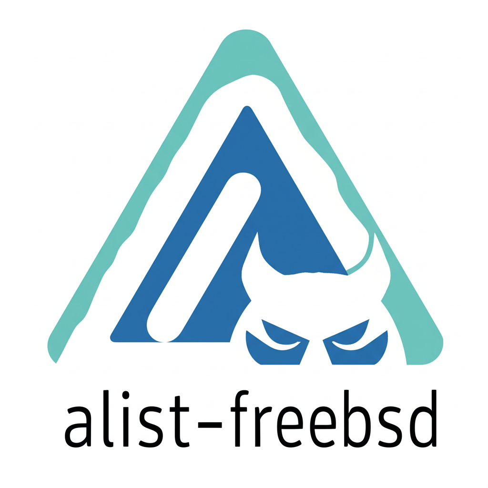

<!-- Improved compatibility of back to top link -->

<a id="readme-top"></a>

[![Contributors][contributors-shield]][contributors-url]
[![Forks][forks-shield]][forks-url]
[![Stargazers][stars-shield]][stars-url]
[![Issues][issues-shield]][issues-url]
[![License][license-shield]][license-url]

<br />
<div align="center">
  <a href="https://github.com/LoveDoLove/alist-freebsd">
    <!-- If you have a logo, place it in images/logo.png -->
    <!--  -->
  </a>

  <h3 align="center">alist-freebsd</h3>

  <p align="center">
    FreeBSD build wrapper for the upstream <a href="https://github.com/alist-org/alist">alist</a> project.
    <br />
    <a href="https://github.com/LoveDoLove/alist-freebsd"><strong>Explore the docs »</strong></a>
    <br />
    <br />
    <a href="https://github.com/LoveDoLove/alist-freebsd/issues/new?labels=bug&template=bug-report---.md">Report Bug</a>
    &middot;
    <a href="https://github.com/LoveDoLove/alist-freebsd/issues/new?labels=enhancement&template=feature-request---.md">Request Feature</a>
  </p>
</div>

<details>
  <summary>Table of Contents</summary>
  <ol>
    <li><a href="#about-the-project">About The Project</a></li>
    <li><a href="#built-with">Built With</a></li>
    <li><a href="#getting-started">Getting Started</a></li>
    <li><a href="#usage">Usage</a></li>
    <li><a href="#roadmap">Roadmap</a></li>
    <li><a href="#contributing">Contributing</a></li>
    <li><a href="#license">License</a></li>
    <li><a href="#contact">Contact</a></li>
    <li><a href="#acknowledgments">Acknowledgments</a></li>
  </ol>
</details>

## About The Project

This repository provides a build wrapper and automation for compiling the upstream [alist](https://github.com/alist-org/alist) project for FreeBSD. It includes a custom `build.sh` script and GitHub Actions workflows to automate building and cleaning up workflow runs. The resulting binary is suitable for running on FreeBSD systems.

<p align="right">(<a href="#readme-top">back to top</a>)</p>

### Built With

- [Go](https://golang.org/)
- [FreeBSD](https://www.freebsd.org/)
- [alist](https://github.com/alist-org/alist)
- [alist-web](https://github.com/alist-org/alist-web)

<p align="right">(<a href="#readme-top">back to top</a>)</p>

## Getting Started

To build and run alist for FreeBSD, follow these steps.

### Prerequisites

- Go (latest version recommended)
- clang with FreeBSD cross-compilation support
- FreeBSD sysroot (the build script downloads this automatically)
- wget, git, bash

### Installation

1. Clone this repository:
   ```sh
   git clone https://github.com/LoveDoLove/alist-freebsd.git
   cd alist-freebsd
   ```
2. Run the build script:
   ```sh
   bash build.sh
   ```
   This will download the latest upstream alist and alist-web, set up the FreeBSD environment, and build the binary.

<p align="right">(<a href="#readme-top">back to top</a>)</p>

## Usage

After building, the `alist` binary will be available in the project directory. Transfer it to your FreeBSD system and run as you would the upstream alist binary. For configuration and usage, see the [alist documentation](https://github.com/alist-org/alist#readme).

<p align="right">(<a href="#readme-top">back to top</a>)</p>

## Contributing

Contributions are welcome! Please use the provided issue templates for bug reports and feature requests. Fork the repo, create a feature branch, and submit a pull request.

1. Fork the Project
2. Create your Feature Branch (`git checkout -b feature/AmazingFeature`)
3. Commit your Changes (`git commit -m 'Add some AmazingFeature'`)
4. Push to the Branch (`git push origin feature/AmazingFeature`)
5. Open a Pull Request

<p align="right">(<a href="#readme-top">back to top</a>)</p>

### Top contributors:

<a href="https://github.com/LoveDoLove/alist-freebsd/graphs/contributors">
  
</a>

## License

Distributed under the MIT License. See `LICENSE` for more information.

<p align="right">(<a href="#readme-top">back to top</a>)</p>

## Contact

LoveDoLove - [GitHub](https://github.com/LoveDoLove)

Project Link: [https://github.com/LoveDoLove/alist-freebsd](https://github.com/LoveDoLove/alist-freebsd)

<p align="right">(<a href="#readme-top">back to top</a>)</p>

## Sponsorship

This project is proudly supported by [ZMTO](https://www.zmto.com) as part of their open-source VPS program. We extend our sincere gratitude to ZMTO for their valuable resources and commitment to empowering open-source innovation.

<p align="right">(<a href="#readme-top">back to top</a>)</p>

## Acknowledgments

- [alist](https://github.com/alist-org/alist)
- [alist-web](https://github.com/alist-org/alist-web)
- [Best-README-Template](https://github.com/othneildrew/Best-README-Template)

<p align="right">(<a href="#readme-top">back to top</a>)</p>

<!-- MARKDOWN LINKS & IMAGES -->

[contributors-shield]: https://img.shields.io/github/contributors/LoveDoLove/alist-freebsd.svg?style=for-the-badge
[contributors-url]: https://github.com/LoveDoLove/alist-freebsd/graphs/contributors
[forks-shield]: https://img.shields.io/github/forks/LoveDoLove/alist-freebsd.svg?style=for-the-badge
[forks-url]: https://github.com/LoveDoLove/alist-freebsd/network/members
[stars-shield]: https://img.shields.io/github/stars/LoveDoLove/alist-freebsd.svg?style=for-the-badge
[stars-url]: https://github.com/LoveDoLove/alist-freebsd/stargazers
[issues-shield]: https://img.shields.io/github/issues/LoveDoLove/alist-freebsd.svg?style=for-the-badge
[issues-url]: https://github.com/LoveDoLove/alist-freebsd/issues
[license-shield]: https://img.shields.io/github/license/LoveDoLove/alist-freebsd.svg?style=for-the-badge
[license-url]: https://github.com/LoveDoLove/alist-freebsd/blob/main/LICENSE
